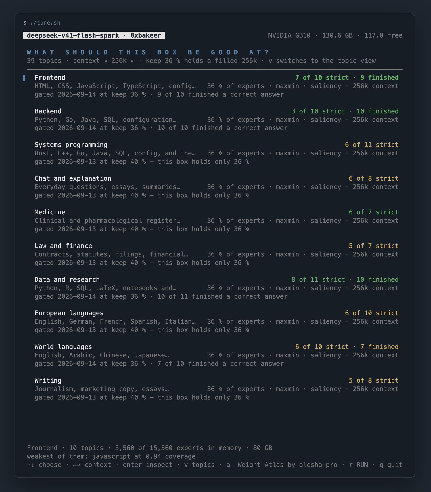

# DeepSeek-V4.1-Flash on a single NVIDIA DGX Spark

> **Status: v0.5.0 (2026-09-14).** Measured, with the limits stated. Ten profiles have a
> generation gate with thinking on; at the keep fraction that holds a filled 256k context the
> code-bearing profiles finish 9 to 10 of 10 prompts, and every number is dated in
> [RESULTS.md](RESULTS.md). Languages other than English with thinking on, and long generations
> in general, are the open items; [LIMITATIONS.md](LIMITATIONS.md) is what does not work. The
> measurements were taken from this checkout on the box, not from the container image.

Serve **DeepSeek-V4.1-Flash** — 510 GB on disk, 15,360 routed FP4 experts, Engram n-gram
memory, CSA2/CED sparse attention, a DSpark drafter — on **one** GB10 box (sm_121a, 128 GB
unified memory, ~121 GiB visible), at **full FP4 expert quality**, from a plain-PyTorch engine
with one Triton kernel.

The point of this recipe is the one thing no published source does:

> **Keep a measured hot set of FP4 experts resident and stream every miss off NVMe with
> `O_DIRECT`, so the quality is the checkpoint's and only the speed pays.**

Every other single-box approach to this model shrinks the weights until they fit. This one
does not shrink anything. What runs:

- **one GB10 / DGX Spark class box** — no tensor parallelism, no second machine;
- **full FP4 expert quality** — the checkpoint's own e2m1 experts, never requantised, never
  pruned;
- **a resident hot set + NVMe streaming** — a 73.8 GB arena holds 25.6 % of the routed
  experts, ranked by a measured 40-layer routing trace; the other 74.4 % are read from the
  shards on demand;
- **DSpark speculative decoding** — the checkpoint's own drafter, lossless (the target
  verifies every drafted token), worth 1.5x here;
- **an OpenAI-compatible API** — `/v1/chat/completions`, `/v1/completions`, `/v1/models`,
  streaming, tools, thinking/effort;
- **Open WebUI-ready** — reasoning streams as `reasoning_content` and renders in the
  collapsible pane with no configuration.

## The numbers

### v0.4.0-wip (2026-09-12) — the numbers, and a correction

`EXPERT_FORMAT=cb3`, keep-set ranked on `results/trace-union`. The top ~40 % of routed experts per
layer stay routable and resident in a 3-bit per-row codebook packed from the checkpoint's own FP4
experts; the rest are never read at serving time. One request each through the server, measured
with the engine's own counters:

| workload | tok/s | where |
|---|---|---|
| single-file HTML game | **36.6** | [RESULTS.md v0.4.0-wip](RESULTS.md) |
| SQL schema and query | **31.8** | same |
| JavaScript module | **28.2** | same |
| Python module | **24.3** | same |
| long story (temperature 0.7) | **17.1** | same |
| prefill, 5,014-token prompt | **337 tok/s** (14.9 s) | same |
| resident set | 6,779 experts = 44.1 %, hit rate 1.0 | same |

Every one of those was produced under a generation gate: five prompts of 900-2,000 tokens that must
stay coherent and, where they finish on their own, be structurally intact. That gate exists because
teacher-forced loss does not see degeneration — the previous tag's default measured better on loss
and could not write an HTML file.

**Two corrections since, both in [`LIMITATIONS.md`](LIMITATIONS.md).** The 44 % arena those rows
were taken on does not reliably serve: it leaves 5.5 GB where one prefill chunk needs about 10, and
on a second day it loaded, reported ready, and was killed by the memory watchdog on the first
request. The shipped default is now 39 % in an 87 GB arena, which leaves 16.5 GB. And the gate runs
to 2,000 tokens; past that, generations still degenerate.

### v0.1.0-wip (2026-09-10) — the original streaming mode (kept for the record)

**Measured 2026-09-10**, one GB10 box (128 GB unified / 121 GiB visible, 1 local NVMe,
Ubuntu 24.04 / DGX OS, driver 580.173.02, CUDA 13) with the unified pool to itself. Exact
config: `MAX_SEQ=32768`, `SPEC=1`, thinking **off**, arena auto-sized to **73.8 GB = 3,926
slots = 25.6 % of the 15,360 routed experts**, warm start ranked by
`results/trace-full-20260910/stats/coverage.json`, kernel `triton-fp4`, activation quant off,
`bench/bench.py --workload code --runs 2 --osl 512 --ignore-eos` (temperature 0.6, top_p 0.95,
every run exactly 512 completion tokens).

| | measured | where |
|---|---|---|
| load, process start to `/health` | **~90 s** (63 s non-expert weights + 14 s warm start, 66.3 GB at 4.7 GB/s) | [RESULTS.md §1](RESULTS.md) |
| TTFT, short prompts | **~7–11 s** (6.8 s on a 6-token prompt, 11.05 s median on the 62-token `code` prompt) | [§4](RESULTS.md) |
| decode | **2.64–2.71 tok/s**, median **2.68** (1.75 with DSpark off) | [§3, §4](RESULTS.md) |
| DSpark acceptance length | **~3.0** (3.03 median; 3.71 greedy on a 16-token prompt) | [§3, §4](RESULTS.md) |
| expert hit rate | **~0.83** (0.771–0.834 across runs) | [§3, §4](RESULTS.md) |
| NVMe read per generated token | **~0.9 GB** (0.92 GB) | [§4](RESULTS.md) |
| correctness vs the pure-torch reference port | NLL **+0.006 / +0.026 nats**, top-1 slightly *better* | [§2](RESULTS.md) |
| greedy speculative vs greedy autoregressive | **64 of 64 tokens identical**, first divergence `None` | [§3](RESULTS.md) |

That is 15–30x slower than the same model on four DGX Sparks with every expert resident, and
the reason is not a mystery: at a 25.6 % resident set the engine streams 0.92 GB of expert
weights per generated token, and the NVMe delivers ~2.5 GB/s at the read sizes a decode step
produces. Attention, the Engram lookups and the Triton MoE kernel together are **under 8 % of
decode time**. Everything else is the SSD.

## Benchmarks: work in progress

There is **one** workload row. `prose`, both one-shot generations and every thinking-on run
were stopped before they produced a number, so this repo contains **no measured evidence of a
long (thousands of tokens) generation and no thinking-mode figure at all**, `results/oneshots/`
is empty, and long context (8k+ prompts) has never been attempted at serving time. The table
above is what exists; [RESULTS.md](RESULTS.md) lists every planned row that does not.

Do not quote the early bring-up figures in [NOTES.md](NOTES.md) either — they were taken on a
20 GB debug arena (6.9 % of the routed experts) and are a measurement of that arena, not of
this recipe.

Take your own rows against a running server:

```bash
python3 bench/bench.py --workload code  --runs 2 --osl 512 --ignore-eos --out results/code.json
python3 bench/bench.py --workload prose --runs 2 --osl 512 --ignore-eos --out results/prose.json
```

Every row carries the engine's own `x_engine_stats` — expert hit rate, NVMe GB, Engram rows,
acceptance length, the attention/MoE split — because on a recipe that streams most of its
weights, **a tok/s number without the hit rate and the GB that produced it is an anecdote**.
The four rules the harness refuses to break are in [`bench/README.md`](bench/README.md).

## Why it is built this way

The routed experts are 15,360 × 3 × 2304 × 5120 = 543.6 B weights, which at FP4 + UE8M0/32 is
**288.8 GB**. After ~18.5 GB of non-expert weights and a few GB of KV, one 121 GiB box has
**~85–90 GB left for experts** — an average of **~1.3 bits per weight** if everything must be
resident. Nothing meets a Q4-class quality floor at 1.3 bpw: even with every cold expert at
2.0 bpw only ~9 % could stay at FP4, and the whole set at 2.0 bpw is still 136 GB. So an
all-resident scheme is arithmetically dead, and the only quality-preserving single-box design
left is a resident hot set at native FP4 plus NVMe streaming for the rest.

Whether that works is decided by the routing coverage curve, so it was measured rather than
assumed — the full 40-layer histogram over 10,760 teacher-forced tokens
(`results/trace-full-20260910/`, built by `tools/expert_trace.py` one 7.4 GB layer shard at a
time):

| resident experts | GB (FP4) | static coverage | LRU hit / token | LRU hit / 6-token block |
|---|---|---|---|---|
| 3000 | 56.4 | 0.670 | 0.805 | 0.681 |
| **4000** | **75.2** | **0.748** | **0.855** | **0.764** |
| 5000 | 94.0 | 0.810 | 0.891 | 0.822 |
| 6000 | 112.8 | 0.859 | 0.917 | 0.865 |

The served config sits at 3,926 slots and the hit rate the engine actually reports is 0.830 —
close to the 4,000-slot per-token prediction, which is the one place where a design number and
a serving number can be checked against each other. The full arithmetic, the per-layer
skew, the category-specific hot sets (coding and general top-25 % sets overlap by a Jaccard of
only 0.18–0.31) and the whole design log are in [NOTES.md](NOTES.md) §0.6–0.8 and §B.

## Choosing what the box is good at

About 40 % of the routed experts fit in memory at once, and which 40 % decides what the model
is good at. `./tune.sh` makes that choice on one screen — topics on the left with the fraction
of each one's measured routing the budget keeps resident, the memory it costs on the right,
checked against what this box has free right now, and `r` to start the server with it.

```bash
./tune.sh                                 # interactive
./tune.sh --list                          # the topics this keep-set carries, with coverage
./tune.sh --topics python,html --print    # the environment that selection implies
```



*The profile screen: a named bundle per row, with the verdict its generation gate returned and the keep fraction it was measured at.*

`a` on either screen opens **Weight Atlas by alesha-pro** on the same keep-sets. It exports this
checkout's routing trace into the files that page reads and serves the vendored build
(`tools/atlas/`, MIT) on `127.0.0.1` and a free port: the whole expert field as one grid, 40 layers
by 384 experts, coloured by how much of the output each expert carried, with any of the 39 topics
as a slice and any of the ten shipped keep-sets outlined on it. `--atlas` does the same without a
terminal. The page is somebody else's work, vendored and credited — see
[`CREDITS.md`](CREDITS.md) and [`tools/atlas/UPSTREAM.md`](tools/atlas/UPSTREAM.md).

Fewer topics do not make a step faster — a step reads the experts the token activates either
way. What they buy is a smaller keep fraction for the same coverage, and that is a smaller arena.
How much smaller is the ranking rule's answer, not a constant: under the default
`DSV41_PRUNE_RANK=sum` breadth is expensive — at `PRUNE_KEEP=0.36` the worst-served topic falls
from 0.657 at four selected topics to 0.410 at eighteen — while under `maxmin` the same span costs
it 0.06 (measured 2026-09-12). [`docs/tune.md`](docs/tune.md) has the screen, the arithmetic behind
every number on it, and how to add topics of your own.

**Added 2026-09-13 — the recipe the profiles were last measured on.** How a keep-set is *ranked*
turned out to matter more than which topics are in it. Ranking by how much each expert contributes
instead of how often the router picks it — `DSV41_PRUNE_SOURCE=saliency` with
`DSV41_PRUNE_RANK=maxmin` — removes the rare-token corruption entirely, cuts the think blocks that
never close, and with the largest budget that fits takes seven narrow profiles from 34 to 39 of 61
prompts on the generation harness. [`RESULTS.md`](RESULTS.md) §5 has every run, both controls and
what was refuted. **How large a budget fits depends on the prompts you send.** `PRUNE_KEEP=0.40`
with `ARENA_GB=89.2` (154 experts a layer) served every gate prompt at `MAX_SEQ=262144` and was
then killed by the memory watchdog 582 s into a 195k-token prefill (MemAvailable 0.8 GB), exactly
where `./tune.sh` had said it would not fit. For a context you will actually fill, the measured
point is `PRUNE_KEEP=0.36` with `ARENA_GB=81` at 256k; 0.40 is for prompts under roughly 80k
tokens. `env.example` now ships the rank and the source; the keep fraction and arena stay the
screen's call.

## Two ways to run it

Both are the same server and both read the same `./.env` (copy [`env.example`](env.example)).
[`docs/install.md`](docs/install.md) compares them and lists the host prerequisites — GB10 /
`sm_121a`, a CUDA 13 driver, ≥ 600 GB free on **local NVMe**, and the box essentially to
itself.

### Native — a venv on the box (this is the path every number above came from)

```bash
python3.12 -m venv .venv && . .venv/bin/activate
pip install torch==2.13.0+cu130 --index-url https://download.pytorch.org/whl/cu130
pip install "transformers>=4.57" "tokenizers>=0.21" "safetensors>=0.5" numpy sympy huggingface_hub

cp env.example .env                  # set MODEL_DIR and PYTHON
MODEL_DIR=./models/DeepSeek-V4.1-Flash ./scripts/download-model.sh    # 510 GB, resumable
./start.sh                           # nohup server/app.py --engine v41; waits for /health
./start.sh --no-wait                 # start and return; tail logs/server.log yourself
./stop.sh                            # SIGTERM -> SIGKILL -> wait for the memory to come back
```

`triton` arrives as a dependency of `torch` from the cu130 index and must not be replaced with
a PyPI build — the FP4 MoE kernel is JIT-compiled against whichever Triton is installed.

`start.sh` refuses to start if the port is taken or if less than `MIN_FREE_GIB` (90) is
available, and names the processes and containers holding the pool. The health wait is 20
minutes on purpose: the warm start fills the resident FP4 expert arena from NVMe *before* the
socket is bound, ranked by the newest `results/trace-*/stats/coverage.json` it can find. A
server that is not answering at minute 5 is normal.

### Container — compose or `run.sh`

```bash
cp env.example .env
./run.sh setup     # pull ghcr.io/<owner>/deepseek-v41-flash-spark:<version>, then download the weights
./run.sh serve     # detached; waits for /health
./run.sh logs
./run.sh stop
```

> **The image is untested.** `Dockerfile`, `compose.yaml`, `run.sh` and
> `scripts/entrypoint.sh` are written and `docker compose config` resolves, but **no image has
> been built or run yet** — the first build is the arm64 GitHub Actions job
> ([`.github/workflows/image.yml`](.github/workflows/image.yml)) on a `v*` tag, and nothing has
> served a request from a container. Until that lands, use the native path. `BUILD=1 ./run.sh
> setup` builds it on the box instead of pulling.

The image is arm64 only — the wheels are aarch64 and the box is a GB10, so there is no manifest
list. `compose.yaml` publishes the API on `127.0.0.1` only, mounts the checkpoint at `/models`
and `./results` at `/app/results`, and sets the three flags that are not optional (`--gpus
all`, `--ipc=host`, `--ulimit memlock=-1`). **Do not set `--memory`**: on unified memory that
caps GPU allocations too and the arena auto-sizer will quietly shrink to fit it.

### Check it is alive

```bash
curl -s localhost:8000/health | python3 -m json.tool
curl -s localhost:8000/v1/chat/completions -H 'content-type: application/json' \
  -d '{"messages":[{"role":"user","content":"What is 2+2?"}],"max_tokens":64}'
```

`GET /health` carries `engine_config` — arena GB and slots, resident-expert %, `max_seq`, spec
on/off, trace stats, kernel — and every completion carries `x_engine_stats` with the same
fields plus that request's acceptance length, hit rate, NVMe GB and Engram rows. A benchmark
never has to be *told* how the server was started.

## Open WebUI (or any OpenAI client)

| setting | value |
|---|---|
| Base URL | `http://<host>:8000/v1` |
| API key | anything non-empty; it is not checked |
| Model | `deepseek-v4.1-flash` (whatever `SERVED_MODEL_NAME` says) |
| Streaming | on |

In Open WebUI: **Settings → Connections → add an OpenAI-compatible connection** with that base
URL. The model appears by its served id.

**Reasoning** is streamed as `reasoning_content` (text before `</think>`; the marker itself is
never emitted), which is the DeepSeek/OpenAI convention Open WebUI, LibreChat and the `openai`
Python SDK already understand — the thinking shows up in the collapsible pane with no
configuration.

**Thinking is OFF by default** (`DEFAULT_THINKING=off`). V4.1's template is not a binary
switch: thinking is on or off *and* there is an effort budget 1–100 rendered as a `Reasoning
Effort: N` system prefix. To turn it on for one request, any of these work — first match wins:

```jsonc
{"chat_template_kwargs": {"thinking": true}}   // unambiguous; what bench/bench.py sends
{"enable_thinking": true}                      // vLLM/SGLang convention
{"reasoning_effort": "high"}                   // OpenAI convention -> thinking on, effort 75
```

`reasoning_effort` maps `none`→off, `low`→off/50, `medium`→on/60, `high`→on/75, `xhigh`→on/90,
`max`→on/100, and a bare integer 1–100 → on at that integer. Open WebUI's own *Reasoning
Effort* control sends the top-level field, so setting it to `medium` or higher turns thinking
on by itself. Change the default for every request with `DEFAULT_THINKING=on` /
`DEFAULT_EFFORT=90` in `.env`.

Two expectations to set before anyone else points a client at it:

* **The first token can take minutes on a cold prompt.** Prefill misses almost every expert and
  each miss is an 18.8 MB NVMe read. Raise the client-side request timeout to tens of minutes.
* **One request at a time.** The engine is single-sequence; a second caller does not get an
  error, they get a wait. There is no authentication and the port is loopback-only — put a
  reverse proxy in front of it before it leaves the box.

Full API reference: [`docs/openai-api.md`](docs/openai-api.md) (operator's view) and
[`server/README.md`](server/README.md) (every flag and field).

## Reproduce the checks and the trace

Six checks need nothing at all — no GPU, no checkpoint, no torch — so they run anywhere:

```bash
python3 tools/test_budget.py        # the memory model against two loads this box actually ran
python3 tools/test_engine_kwargs.py # every launcher kwarg is a parameter the engine has
python3 tools/test_tune_draw.py     # the tune screen renders at 7 sizes without colliding
python3 tools/test_atlas_export.py  # the Weight Atlas outlines are the engine's own keep-sets
python3 tools/test_tune_atlas.py    # the `a` key: legend, popup, and a real loopback fetch
python3 server/test_server.py       # the HTTP layer against the mock engine
```

The rest need a server or the checkpoint and an interpreter with torch.

```bash
# the engine's math against the pure-PyTorch reference port (RESULTS.md §2)
python3 engine/v41_engine.py --model-dir ./models/DeepSeek-V4.1-Flash --act-quant \
    --teacher-forced corpus/trace_corpus.jsonl --tf-out results/tf.json

# DSpark on/off/sampled from one load, and where the two greedy runs diverge (RESULTS.md §3)
python3 engine/v41_engine.py --model-dir ./models/DeepSeek-V4.1-Flash --spec-ab \
    --max-tokens 64 --temperature 1.0 --ab-out results/spec_ab.json

```

The routing trace that ranks the warm start, one 7.4 GB layer shard at a time (resumable, so
it can run while the rest of the checkpoint is still downloading):

```bash
python3 tools/make_corpus.py   --tokenizer ./models/DeepSeek-V4.1-Flash --code ... --prose ... \
    --out corpus/trace_corpus.jsonl
python3 tools/engram_rows.py   --model-dir ./models/DeepSeek-V4.1-Flash \
    --corpus corpus/trace_corpus.jsonl --out engram_rows
python3 tools/expert_trace.py  --model-dir ./models/DeepSeek-V4.1-Flash \
    --corpus corpus/trace_corpus.jsonl --engram-dir engram_rows \
    --out results/trace-YYYYMMDD --layers 0-39 --resume
python3 tools/expert_stats.py  --trace results/trace-YYYYMMDD --out results/trace-YYYYMMDD/stats
```

Tracing needs the layer shards (`model-0000{3..42}-of-00048.safetensors`), `model-00002`
(embed), the checkpoint's `inference/` folder and the tokenizer — but **not** the two 101 GB
Engram shards: `tools/engram_rows.py` pulls only the rows the corpus touches over multipart
HTTP range requests. Serving needs all of it.

## Layout

```
start.sh / stop.sh    native launcher: memory and port guards, nohup + pidfile, health wait
run.sh                container dispatcher: setup | serve | logs | stop | shell | bench | config
compose.yaml          loopback-only service, /models bind mount, unified-memory ulimits
Dockerfile            arm64 CUDA-13 devel base, torch cu130 + triton; weights mounted, never baked
scripts/              entrypoint.sh (the container's start.sh) · download-model.sh (510 GB, resumable)
env.example           every knob, for both paths
engine/               the serving engine: v41_engine.py (generation loop, DSpark, arena + NVMe
                      store) · model.py · experts.py · engram.py
server/               OpenAI-compatible front end (app.py), standard library only + 15 e2e tests
tools/                v41_ref.py (pure-torch reference port) · expert_trace.py · expert_stats.py
                      · engram_rows.py · make_corpus.py · fp4_moe.py (the Triton FP4 MoE kernel)
bench/                bench.py + the rules it refuses to break
corpus/               the teacher-forced trace corpus and its (public, MIT) sources
results/              measured rows; results/*/stats/coverage.json ranks the warm start
docs/                 install · architecture · openai-api · benchmarking · gotchas
```

## Documentation

| | |
|---|---|
| [`docs/tune.md`](docs/tune.md) | choosing the topics a keep-set serves, and what they cost |
| [`docs/tune-reference.md`](docs/tune-reference.md) | `./tune.sh` in full: every flag, key, screen field and exit code |
| [`docs/tune-tasks.md`](docs/tune-tasks.md) | picking topics, reading the verdict, fixing an over-budget selection, adding a topic |
| [`docs/keep-sets.md`](docs/keep-sets.md) | what a keep-set, a topic and coverage are, and why coverage predicts degeneration |
| [`docs/memory-budget.md`](docs/memory-budget.md) | every memory term with its provenance, and the two gates a configuration must pass |
| [`docs/install.md`](docs/install.md) | host prerequisites, the checkpoint, both run paths, first start |
| [`docs/architecture.md`](docs/architecture.md) | how the engine is put together |
| [`docs/openai-api.md`](docs/openai-api.md) | endpoints, thinking/effort, streaming, Open WebUI |
| [`docs/benchmarking.md`](docs/benchmarking.md) | how to take a row that means something |
| [`docs/gotchas.md`](docs/gotchas.md) | the sharp edges, found the hard way |
| [`RESULTS.md`](RESULTS.md) | every measured number with the config that produced it, and every one that was not taken |
| [`NOTES.md`](NOTES.md) | the design log: checkpoint layout, architecture facts, the landscape, the size arithmetic, the trace, the bring-up and every bug found |
| [`LIMITATIONS.md`](LIMITATIONS.md) | what does not work, and why |
| [`CHANGELOG.md`](CHANGELOG.md) | a version is a measurement epoch |
| [`CREDITS.md`](CREDITS.md) | whose work this is a thin layer over |

## Citation

If you refer to this recipe, its engine or its measurements, please cite the repository (GitHub's
"Cite this repository" button reads `CITATION.cff`):

```bibtex
@software{bakeer2026dsv41spark,
  author  = {Bakeer, Khaled},
  title   = {deepseek-v41-flash-spark: {DeepSeek-V4.1-Flash} on a single {DGX Spark}},
  year    = {2026},
  month   = sep,
  version = {0.2.0-wip},
  url     = {https://github.com/0xBakeer/deepseek-v41-flash-spark},
  note    = {Resident FP4 expert arena with NVMe expert streaming, CUDA-graph decode with DSpark,
             FP8 dense projections, measured expert-pruning ladder; append-only dated results}
}
```

When citing a specific number, name the tag and the section of RESULTS.md it comes from
(e.g. "v0.2.0-wip, RESULTS.md §2.3"), since every tag keeps its own measured tables.

## License

MIT (this repo). DeepSeek-V4.1-Flash weights and reference code are MIT (deepseek-ai) — read
the model licence before deploying commercially.
