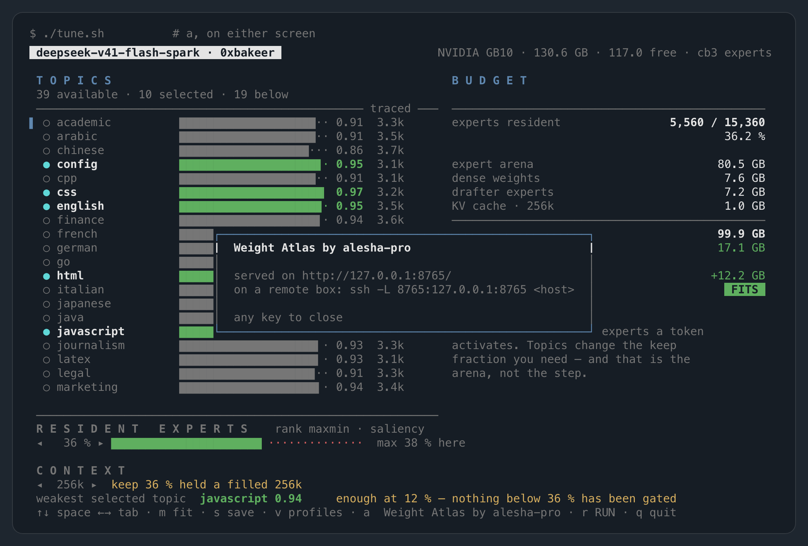
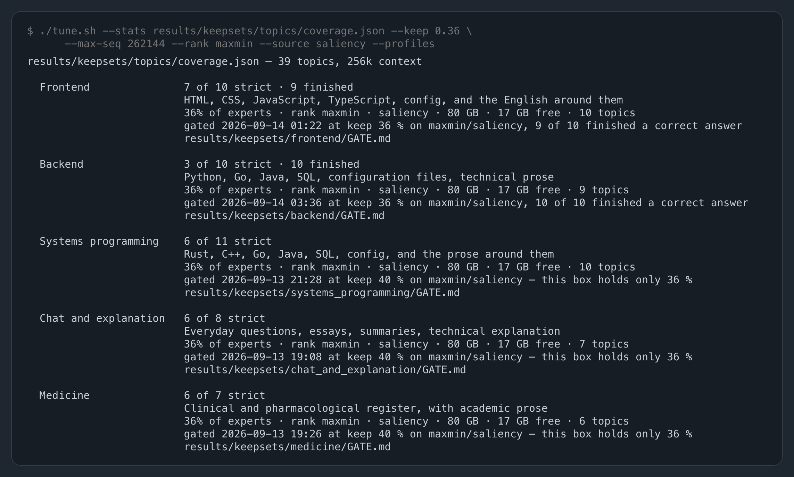

# `./tune.sh` reference

Every flag, every key, every field on the screen and what it is computed from. The reasoning
behind the tool is in [`docs/tune.md`](tune.md); the ideas it works with — keep-set, topic,
coverage — are in [`docs/keep-sets.md`](keep-sets.md); the memory arithmetic behind the right-hand
panel is in [`docs/memory-budget.md`](memory-budget.md).

`tune.sh` sources `./.env` before running `tools/tune.py`, so every default below that names an
environment variable is read from `.env` as well as from the shell.

## Invocation

```bash
./tune.sh                          # interactive, needs a terminal of at least 70x20
./tune.sh --list                   # the topics this keep-set carries, with coverage
./tune.sh --topics coding --print  # the environment that selection implies
./tune.sh --render 30x96           # the screen as text, no terminal needed
./tune.sh --atlas                  # serve Weight Atlas on this keep-set, no terminal needed
```

The interactive screen is used only when stdout is a terminal **and** none of `--list`, `--print`,
`--write`, `--render`, `--profiles`, `--save-profile`, `--brief`, `--atlas` or `--atlas-export`
was given. In a pipe or a CI
job, a bare `./tune.sh` behaves as `--print`.

## Flags

| flag | default | what it does |
|---|---|---|
| `--stats PATH` | see below | the `coverage.json` to read topics and histograms from |
| `--topics a,b` | `EXPERT_TOPICS` | the selection to start from, comma separated |
| `--keep F` | `PRUNE_KEEP`, else `0.39` | the fraction of each layer's 384 routed experts that stays resident. Applying a profile replaces it: a shipped one sets the keep fraction its generation gate ran at, a profile from a file the smallest one that reaches the coverage target |
| `--max-seq N` | `MAX_SEQ`, else `32768` | context length the KV cache is sized for |
| `--format cb3\|fp4` | `EXPERT_FORMAT`, else `cb3` | the arena's expert layout, which sets the slot size |
| `--rank sum\|max\|maxmin` | `DSV41_PRUNE_RANK`, else `sum` | how several selected topics are combined into one ranking of the same budget, which decides *which* experts the keep fraction holds. Shown on both screens next to the keep fraction, and written out with it. Applying a profile with a gate record sets the rule that record was measured with (`maxmin` for all ten shipped ones); a profile from a file names no rule and leaves it alone |
| `--source counts\|saliency` | `DSV41_PRUNE_SOURCE`, else `counts` | which measurement the experts are ranked by: `counts` is routing frequency, `saliency` is the summed `gate_weight x ||expert output||` (REAP, arXiv 2510.13999). Orthogonal to `--rank` — the rules are the same, the numbers they rank are not. Shown beside the rank and written out with it. Applying a profile with a gate record switches to the family that record was measured on, reloading the index so the bars and the budget move with it; where the keep-set carries no histograms of that family, nothing switches and the mismatch is named. A `coverage.json` traced before 2026-09-13 carries no `saliency_<topic>` histograms and the tool then finds no topics at all. See [`docs/keep-sets.md`](keep-sets.md#frequency-is-not-contribution) |
| `--transient-slots N` | `TRANSIENT_SLOTS`, else `8` | prefill slots outside the LRU; the arena is sized to hold these too |
| `--keep-free-gb F` | `KEEP_FREE_GB`, else `6.0` | host memory the launcher is told to leave free |
| `--coverage-target F` | `DSV41_COVERAGE_TARGET`, else `0.85` | the coverage every selected topic should reach; sets the bar colours and what `m` fits to |
| `--render HxW` | — | print the screen as text at that size and exit. **Height first**: `30x96` is 30 rows of 96 columns |
| `--list` | — | print the topics with their coverage at `--keep` and their traced token counts, then exit |
| `--print` | — | print the environment the current settings imply, then exit |
| `--write` | — | write those settings into `./.env` and exit |
| `--profiles` | — | print the ready-made profiles with what each one needs and how its generation gate went, then exit |
| `--profile NAME` | — | start from that profile's topics and its keep fraction — the one its gate was run at for a shipped profile, the one the coverage target needs for a profile from a file. Matched case-insensitively on the start of the name, and an ambiguous match exits 2 |
| `--profiles-file PATH` | `DSV41_TUNE_PROFILES` | read user profiles from this file instead of the two default locations, and save to it |
| `--save-profile NAME` | — | keep the current selection under that name in the user profiles file, then exit |
| `--describe TEXT` | the topic names | the one-line description `--save-profile` writes |
| `--brief` | — | print the task of adding a topic to this keep-set, as Markdown, then exit |
| `--atlas` | — | what `a` does, without a terminal: export the routing trace if it is stale, serve the vendored Weight Atlas build (`tools/atlas/`) on `127.0.0.1` and a port the kernel picks, print the URL and the ssh-tunnel line, and keep serving until `Ctrl-C`. Binds loopback only, and the socket dies with the process |
| `--atlas-export` | — | write the Weight Atlas data files (`tools/atlas/models/`, ~5.6 MB, gitignored) and exit, serving nothing. Unlike `a` and `--atlas` it writes whether or not the export is stale |

Without `--stats`, the file is chosen in this order:

1. `results/keepsets/$EXPERT_PROFILE/coverage.json`, if `EXPERT_PROFILE` is set and that file exists;
2. otherwise every `results/keepsets/*/coverage.json` and `results/trace-*/stats/coverage.json` in
   the checkout is scanned and the one carrying the most topics wins, ties going to the first in
   that order.

A `coverage.json` written before per-category histograms were added carries no topics at all. The
tool still runs — the budget panel is live and the keep and context sliders work — but the topic
pane says `this keep-set carries no per-topic histogram` and `--list` exits 1.

## Exit codes

| code | meaning |
|---|---|
| 0 | the configuration will load (`FITS` or `TIGHT`); also a successful `--list` or `--render`, and quitting the interactive screen with `q` |
| 1 | the configuration will not load (`WILL NOT LOAD`); also `--list` on a keep-set with no per-topic histograms |
| 2 | a topic was named that this keep-set does not carry; also a `--render` argument that is not `HxW`, a `--profile` that matches no profile or more than one, and a `--save-profile` with nothing selected or onto a profiles file that does not parse |

`--print` is therefore usable as a check in a script: it exits non-zero exactly when the selection
would not serve. Note that `TIGHT` exits 0 — it means the margin is under 3 GB, not that it fails.

`--atlas` and `--atlas-export` exit 2 when the trace they read is missing, or when
`tools/atlas/` is not in the checkout; `--atlas` otherwise exits 0 when it is stopped.

A profiles file that cannot be read does not change any exit code. It costs the profiles in that
file and nothing else: the problem goes to stderr, the tool starts on the built-in profiles, and
`--list`, `--print` and `--write` behave exactly as they would have. `--brief` exits 0 whether or
not the keep-set carries any topics.

After `r` in the interactive screen the exit code is `./start.sh`'s.

## Keys

| key | effect |
|---|---|
| `↑` `↓`, `k` `j` | move the topic cursor |
| `PgUp` `PgDn` | move it ten rows |
| `space` | select or deselect the topic under the cursor |
| `A` | select every topic currently visible (the filter applies) |
| `n` | deselect every visible topic |
| `a` | open **Weight Atlas by alesha-pro** on this checkout's routing trace — see below |
| `/` | start typing a filter; `Enter` keeps it, `Esc` clears it |
| `Tab`, `Shift-Tab` | cycle the focused pane: topics, resident experts, context |
| `←` `→` | adjust the focused slider. Context steps 4k, 8k, 16k, 32k, 64k, 128k, 256k; every other pane steps the keep fraction by 2 points between 6 % and 60 % |
| `m` | snap the keep fraction to the smallest one at which every selected topic reaches the coverage target. It says so on the key line when that lands below the smallest keep fraction any generation gate has been run at |
| `f` | switch the arena format between `cb3` and `fp4` |
| `s` | keep this selection as a profile: type a name on the key line, `Enter` saves it, `Esc` cancels |
| `r` | write `.env` and run `./start.sh` |
| `w` | write `.env` and stop |
| `q` | quit without writing |

`f` and `w` are not in the on-screen key line. `r` refuses while something else is holding an arena,
and refuses a configuration whose verdict is `WILL NOT LOAD`; `w` does neither, so it can write an
over-budget `.env` on purpose.

`s` writes the user profiles file described below and reports the path on the key line. It refuses
an empty selection and an empty name, and it refuses to write over a profiles file it could not
read, because that would take the profiles already in it. A saved profile is on the profile screen
immediately, without a restart.

On the profile screen the keys are `↑` `↓` to choose, `←` `→` for the context length, `Enter` to
apply a profile and switch to the topic screen, `v` to switch without applying, `w`, `r`, `q` as
above, and:

| key | effect |
|---|---|
| `b` | write the topic task brief to `tune-brief.md` in the checkout, and say so on the key line |
| `a` | open **Weight Atlas by alesha-pro** — the same key, the same server, on both screens |

### `a` — Weight Atlas by alesha-pro

[Weight Atlas](https://github.com/alesha-pro/atlas) (MIT, [atlas.alesha.pro](https://atlas.alesha.pro))
draws a MoE model's expert field as one grid: a column per expert, a row per layer, coloured by how
much of the output each expert carried. `a` shows this box's keep-sets on it.

Pressing it:

1. runs `tools/atlas_export.py` if the export is **stale** — missing, or older than
   `results/keepsets/topics/coverage.json`, `results/keepsets/gates.json` or `tools/tune.py`. That
   takes about two seconds and the key line says so while it runs. The output,
   `tools/atlas/models/` (~5.6 MB), is generated and not committed;
2. serves `tools/atlas/` — the vendored build — from a `ThreadingHTTPServer` in a daemon thread,
   bound to `127.0.0.1` on a port the kernel picks. Never `0.0.0.0`, and it dies with the screen;
3. opens a browser where there is one, and draws a popup with the URL, the ssh-tunnel line for a
   box you are on over ssh, and `any key to close`. Pressing `a` again shows the same port.

What is on the page: the 40 × 384 grid coloured by REAP saliency, each of the 39 traced topics as
a slice (and as a ratio against every topic at once), routing share and mean contribution as
alternative colourings, and each of the ten shipped profile keep-sets as an outline — the same
expert ids `tools/budget.py` hands the engine, at the keep fraction that profile's generation gate
was measured at. No weight scan is taken, so the weight wall above the grid is hatched and the
eleven cards that need other captures are not drawn.

The export always reads the topic catalogue (`results/keepsets/topics/coverage.json`), whatever
`--stats` the screen itself is on: the page is the trace, not the current selection.



*The popup `a` leaves over whichever screen was up: the port the kernel picked, the ssh-tunnel line for a box reached over ssh, and any key to close it.*

## Profiles from a file

The profiles on the first screen are the ten built into `tools/tune.py` plus whatever these two
files carry, read in this order:

1. `results/keepsets/profiles.json`, inside the checkout, for a profile that should travel with it;
2. `$XDG_CONFIG_HOME/deepseek-v41-flash-spark/profiles.json` (`~/.config/...` when that variable is
   unset), for this user's own.

Neither is shipped and neither has to exist. `--profiles-file PATH` replaces both, for reading and
for saving. The user's file is read last, so a profile in it replaces one of the same name from the
checkout file or from the built-in list; the replacement happens in place, so the order of the
screen does not move. Names are matched without regard to case. `s` and `--save-profile` write to
the last file in that list, which is the user's own unless `--profiles-file` says otherwise: a
profile kept there survives a fresh clone and leaves the working tree clean.

```json
{
  "profiles": [
    {"name": "Arabic desk",
     "description": "Arabic and English prose, for a bilingual assistant",
     "topics": ["arabic", "english", "translation"]}
  ]
}
```

A bare JSON list of the same objects is accepted as well. A profile is a `name`, a one-line
`description` (optional) and a non-empty list of `topics`. Whitespace in the name and the
description is collapsed, so both stay one line on the screen, and a topic named twice counts once:
the ranking gives every selected topic one vote per layer, and writing it twice does not mean two.
Any other field is ignored, `gated` included: **a profile from a file owns no gate record** and the
screen says `untested` for it, because the gate is a generation run on a keep-set and not a
property of a name and a list of topics. It is budgeted from the coverage target for the same
reason — there is no measured keep fraction for it to use. See
[`docs/keep-sets.md`](keep-sets.md) for what the gate is and
[`results/keepsets/*/GATE.md`](../results/keepsets/) for what one looks like written down.

What happens when a file is wrong:

| what is wrong | what the tool does |
|---|---|
| the file is not there | nothing; there are simply no profiles from it |
| it is not valid JSON, or not a list of profiles | one line on stderr naming the file and the parser's complaint, then the built-in profiles as usual. The interactive screen repeats it in the row under the header, where stderr cannot be seen |
| one entry has no name, is not an object, or has no usable `topics` | one line naming that entry, by name where it has one and by position where it does not. Every other entry in the file is still loaded |
| an entry names a topic this keep-set does not carry | one line naming the profile and every missing topic. The profile still applies, with the topics that do exist, and the profile screen prints `not in this keep-set: ...` under it |

The last row is the one that matters in practice. Topic names differ between keep-sets, so a
profiles file written against a 35-topic keep-set applies to a two-topic one with most of itself
missing, and a selection that is quietly three topics short looks exactly like one that worked.

## The screen

Minimum size is 70 columns by 20 rows; below that the tool prints the size it needs and the
non-interactive alternatives. The left pane is `max(46, 0.54 x width)` columns wide, the budget
panel starts three columns after it, and the coverage bar inside a topic row is
`max(8, left_pane - 37)` columns. The whole screen is redrawn once a second so that
`MemAvailable` is current; the probe for another process holding an arena runs every four
seconds because it walks `/proc`.

### Header

| field | computed from |
|---|---|
| box name | `/proc/device-tree/model` or the DMI product name, replaced by `nvidia-smi --query-gpu=name` when that is not already part of it, falling back to the host name |
| total GB | `MemTotal` in `/proc/meminfo` |
| free GB | `MemAvailable` in `/proc/meminfo`, re-read every second |
| format | the current `--format`, `cb3` or `fp4` |

On a GB10 there is no second pool to ask about. The memory is unified and `nvidia-smi` answers
`[N/A]` for `memory.total`, `memory.used` and `memory.free`, so `/proc/meminfo` is the only honest
source — and it is the one the engine's own pre-flight compares against.

Off Linux there is no `/proc/meminfo`, so the header falls back to a GB10's 130.6 GB total and
117.0 GB available and says so, which is what makes `--render` reproducible anywhere.

The row under the header carries one of three warnings, or nothing, in this order:

* `already running here: <script> (pid N) — this box holds one at a time`, when a Python process
  whose script argument is `v41_engine.py`, `app.py`, `expert_trace.py` or `engram_rows.py` is
  alive. Only the script argument counts, so a shell watching for those names does not match.
* `profiles: <file>: <what is wrong>`, when a profiles file could not be read. It outranks the note
  below it because it is an error rather than a caveat, and because stderr is not visible here.
* `not a GB10 -- numbers are the model's, not this machine's`, when the box is not a GB10.

### Topics pane

The sub-line reads `N available · M selected`, plus `filter: X` while a filter is active, plus
`· K below` and `· K above` when the list is scrolled.

| column | content | computed from |
|---|---|---|
| 0 | `▌` | the cursor, when this pane has focus |
| 2 | `●` / `○` | selected or not |
| 4 | topic name | truncated to 16 characters |
| 22 | coverage bar | `curve[ceil(keep x 384)]` for that topic under the current selection, at eighth-block resolution |
| after the bar | the same number as `0.NN` | as above |
| right of that | traced tokens | `sum(histogram) / (40 x 6)`, printed as `NNk` at or above 10,000, `N.Nk` at or above 1,000, otherwise the count itself |

The bar is **solid** when the topic was traced on 2,000 tokens or more and **hollow** below that.
A hollow bar is not merely uncertain, it is biased upward; see
[`docs/keep-sets.md`](keep-sets.md#a-thinly-traced-topic-reports-coverage-that-is-too-high).

Colour follows the coverage target: at or above it the bar is green, at or above 0.70 amber, below
that red, and a thin topic is drawn muted whatever its number says. Unselected rows are muted.
A topic with no curve at all shows a row of dots and a dash.

The curves are computed for the **current selection**: with nothing selected the engine would rank
on every topic in the file, so that is what the bars show. Every topic in the file gets a curve,
selected or not, which is how the cost of a narrow selection to the rest of the file is visible on
the same screen.

### Budget panel

Each row is a term of the memory arithmetic. The full derivation, with where every constant comes
from, is in [`docs/memory-budget.md`](memory-budget.md).

| row | value |
|---|---|
| experts resident | `ceil(keep x 384) x 40` out of `15,360`, and the same as a percentage |
| expert arena | `(kept + transient_slots) x slot_bytes`, slot 14,454,784 B for `cb3` and 18,800,640 B for `fp4` |
| dense weights | 7.61 GB, fixed |
| drafter experts | `3 x 128 x 18,800,640` = 7.22 GB, fixed |
| KV cache · Nk | `max_seq x 3,200 + 180,355,072`, shown in MB below 1 GB |
| resident | the four rows above, added |
| free after load | `MemAvailable − resident` |
| room to launch | `MemAvailable − (arena + pack scratch + dense + max(keep-free floor, one prefill chunk + the 2.5 GB watchdog floor))`, pack scratch 3 GB for `cb3` and 1 GB for `fp4` |
| verdict | `FITS`, `TIGHT` or `WILL NOT LOAD` |

The verdict is the two gates together:

```
will not load   room to launch < 0  or  free after load < a prefill chunk plus the 2.5 GB watchdog floor
tight           room to launch < 3 GB  or  free after load < that chunk + 3 GB
fits            otherwise
```

Two colouring details are worth knowing, because they are not the verdict rule:

* `free after load` turns red only below the keep-free floor (6 GB by default), so between that
  floor and what a prefill chunk needs it is drawn green while the verdict already says
  `WILL NOT LOAD`. The badge is the number to act on.
* `room to launch` is green at 3 GB or more, amber down to 0, red below.

The four-line note about step time only appears when the window is at least 28 rows tall.

### Resident experts

`◂ NN % ▸` and a bar scaled so full width is 60 % keep. The part of the bar past `max NN % here` is
drawn red: that is the largest keep fraction this box can both start and survive a prefill chunk at,

```
max_arena = min( MemAvailable − pack scratch − dense − keep-free floor,
                 MemAvailable − dense − drafter − KV − one prefill chunk )
max_keep  = (max_arena / slot_bytes − 8) / 15,360
```

On a 121 GiB box that lands near 42 % in `cb3` and near 32 % in `fp4`. It moves with `MemAvailable`,
so it moves while the screen is open.

### Context

`◂ NNk ▸` and one of two messages:

* at or below `VALIDATED_MAX_SEQ`, `run to 128k here; the cache alone has room for X` — where `X` is
  `(free after load − keep-free floor) / 3,200 bytes`, the tokens the cache could hold if nothing
  else wanted the memory;
* above it, `past the 128k run here — prefill is the limit; keep 36 % held a filled 256k`, in
  amber. The cache is not what runs out up there — it is 1.0 GB at 256k — the prefill is, and the
  keep fraction is the lever: 0.36 held a filled 256k and 0.40 was killed by the memory watchdog on
  a 195k-token prefill (`RESULTS.md`, 2026-09-13 22:50).

That length is `tools/budget.py` `VALIDATED_MAX_SEQ`, and on 2026-09-12 it became **131,072** — the
longest context this engine has actually loaded and prefilled from. (It read 32,768 until then; the
messages carry whatever the constant says, so they moved with it.) Above it the KV arithmetic still
holds but the prefill path has not been run there, so the tool marks the length rather than
predicting it.

Both messages have a short form for narrow windows.

### The line above the keys

One line, in priority order:

1. `N selected topics traced on too little text — those bars read high because the sample chose the
   experts`, when any selected topic is under 2,000 traced tokens. Narrow windows get the short
   form, `… — bars read high`.
2. `weakest selected topic  <name> <coverage>`, coloured by the same thresholds as the bars, plus
   an advice fragment on the right:
   * `at the NN % this box holds, K of N reach 0.85` when the keep fraction the target needs is
     larger than `max_keep`;
   * `raise to NN % for 0.85 on every one` or `enough at NN % …` when the needed fraction differs
     from the current one by more than half a point. Below 96 columns only the percentage is shown.
   * when that needed fraction is below the smallest one any gate in `gates.json` was run at, the
     sentence becomes `enough at 12 % — nothing below 36 % has been gated` and turns amber: the
     coverage target is reachable there and nothing that small has been asked to generate anything.
3. `no topic selected — the keep-set would use all of them`.

The bottom line carries the key hints, or a message from the last keypress, or the prompt `s`
opens. A message lasts until the next key. Both screens use that line: on the profile screen it is
where `b` says where it wrote the brief, and where `r` says why it refused.

### Profile screen

Three rows per profile, and a fourth of white space when the window is at least 25 rows tall:

1. the name, with `· yours` after it when the profile came from a file, and the **gate verdict** at
   the right edge;
2. the description, with the budget the profile needs at the right edge — `36 % of experts · maxmin
   · saliency · 32k context`, shortened before the description is when the window is narrow;
3. `not in this keep-set: ...` when this keep-set is missing some of the profile's topics, and
   otherwise the **gate line**.

The sub-line under the heading reads `N topics · context ◂ 32k ▸`, plus which keep fraction holds a
filled 256k context, plus `v switches to the topic-by-topic view` — as much of that as fits, in that
order of preference, always stopping short of the `N more below` marker that shares the row.

#### The gate verdict and the gate line

Every shipped profile has been through `tools/gate_profile.py` and the screen reads the result back
out of `results/keepsets/<record>/GATE.md` while it draws. A profile's record is the **newest full
run in that file whose topic list is exactly the profile's** — a filtered re-run (`| only |` in its
card) is never a record, because it says the prompts it ran pass and nothing about the ones it did
not, and neither is a run on a different bundle.

| what is shown | where it comes from |
|---|---|
| `7 of 10 strict` | the runs the gate passed outright, out of `**Verdict:**` in that section |
| `· 9 finished` | the strict passes plus the runs whose only fault was a repeated window and which produced the correct answer anyway. Counted from 2026-09-14 on; older records show the strict count alone |
| `gated 2026-09-14` | the date in the section heading |
| `at keep 36 %` | `\| keep-set \|` in the card, and for runs recorded before that row existed, `results/keepsets/gates.json` |
| `on maxmin/saliency` | the same, and shown **only** when that pair is not the one the screen is set to — the bars and the counts then describe two different keep-sets |
| `— this box holds only 38 %` | the gated keep fraction does not fit here, so what `r` would start is not what was measured |

Colour follows `finished` where it was counted and `strict` otherwise: green at 0.8 of the runs or
better, amber at 0.5, red below.

A profile with no record — one from a file, or a shipped one whose topics this keep-set does not
all carry — shows no gate line and its status is the coverage wording instead: `serves all of it`
at or above the coverage target, then `good` at 0.75, `uneven` at 0.65, `spread thin` below that,
each followed by `· untested`; `needs a bigger box` when no keep fraction that fits reaches it, and
`not in this keep-set` when none of its topics is in the file at all.

#### What applying a profile sets

A profile with a gate record applies **the whole configuration that record was measured in**: its
topics, the keep fraction, the ranking rule and the histogram family. The last two matter as much
as the first two — a keep fraction reproduced without its pair holds a different set of experts, so
`--print` and `--write` would otherwise emit a recipe that is not the one the counts on the screen
came from. Switching the family reloads the index, so the coverage bars, the budget panel and the
written `.env` all describe the keep-set that was gated, and the gate line stops naming a pair
because there is no longer one to name.

Where the loaded keep-set carries no histograms of the record's family, nothing switches: writing
`DSV41_PRUNE_SOURCE=saliency` for a file that has only `counts_<topic>` produces a configuration
the engine refuses three minutes into a load. The keep fraction and the rule are still taken, the
gate line goes on naming the pair, and `--profile` says on stderr that what follows is not the
keep-set that was gated.

A profile from a file names no pair and changes neither. An explicit `--rank` or `--source` on the
command line is overridden by a record, the same way `--rank` already was by a profile's own rule.

#### Which keep fraction a profile is budgeted at

A profile with a gate record is budgeted at **the keep fraction that record was measured at**,
clamped to the largest step this box can hold. One without is budgeted at the smallest step that
reaches the coverage target, clamped the same way.

The difference matters because the coverage target was calibrated on the `counts` histograms under
`sum`. Under `saliency` — what `env.example` ships and what every gate run used — every topic in
the shipped keep-set is above 0.85 at keep 0.12, which is a third of the smallest keep fraction any
generation has ever been run at. Coverage is still a true measurement of routing; it is not a
recommendation under that pair, and the gate record is.

## The gate index, `results/keepsets/gates.json`

One entry per shipped profile: the record directory, the run that is its current record, and the
`keep`, `rank` and `source` that run used, each with the `RESULTS.md` section that states them.

```json
{"runs": [{"record": "backend", "run": "2026-09-14 03:36",
           "keep": 0.36, "rank": "maxmin", "source": "saliency",
           "measured_in": "RESULTS.md, 2026-09-14 06:20 addendum to §5"}]}
```

It exists only because a gate card written before 2026-09-14 does not say which keep-set it
measured. `tools/gate_profile.py` now writes a `| keep-set |` row into the card from
`PRUNE_KEEP`, `DSV41_PRUNE_RANK` and `DSV41_PRUNE_SOURCE` in the environment of the run, and that
row wins over this file when it is there, so new runs need no entry. A missing or malformed
`gates.json` costs the keep fractions of the older runs and nothing else: the counts and the dates
come from the `GATE.md` files either way.

## Non-interactive output

### `--list`

```
results/keepsets/general/coverage.json — 2 topics, coverage at keep 39%
  coding         ███████████████████▊···· 0.83    20,694 tokens
  general        ██████████████████······ 0.75    15,556 tokens
```

Coverage is computed with every topic in the file selected, which is what the engine does when
`EXPERT_TOPICS` is unset. Unlike the interactive bars these are always drawn solid; a thinly traced
topic is marked by a trailing `thin` instead.

### `--profiles`

Every profile, in screen order, with the same facts the screen carries and the path of the record
they came from:

```
  Backend                3 of 10 strict · 10 finished
                         Python, Go, Java, SQL, configuration files, technical prose
                         36% of experts · rank maxmin · saliency · 80 GB · 18 GB free · 9 topics
                         gated 2026-09-14 03:36 at keep 36 % on maxmin/saliency, 10 of 10 finished a correct answer
                         results/keepsets/backend/GATE.md
```

A profile with no record says `no generation gate has been run on these topics` in place of the
last two lines; one this keep-set is missing topics for says which ones instead.



*The first five profiles of `--profiles`, printed with the same flags the screen was opened with.*

### `--print` and `--write`

Both print the managed keys on stdout and a one-line summary on stderr, so the settings can be
captured and the summary still read. This run is off Linux, so the memory figures behind it are the
117.0 GB stand-in:

```
$ ./tune.sh --topics coding --print
PRUNE_KEEP=0.39
DSV41_PRUNE_RANK=sum
DSV41_PRUNE_SOURCE=counts
MAX_SEQ=32768
ARENA_GB=87
EXPERT_FORMAT=cb3
TRANSIENT_SLOTS=8
KEEP_FREE_GB=6
TRACE_STATS=results/keepsets/general/coverage.json
EXPERT_TOPICS=coding
# 6,000 experts resident (39.1%), 102.0 GB resident, 15.0 GB free after load — ok
```

With `--profile` instead of `--topics`, the keep fraction **and the ranking pair** are the ones that
profile's gate record was measured with, whatever the environment says, so the block below
reproduces a measured configuration rather than one assembled out of a coverage target and two
defaults:

```
$ ./tune.sh --profile backend --print
PRUNE_KEEP=0.36
DSV41_PRUNE_RANK=maxmin
DSV41_PRUNE_SOURCE=saliency
MAX_SEQ=32768
ARENA_GB=81
...
```

`ARENA_GB` is `ceil` of the arena the panel shows, and the engine floors it back into slots.
`tools/test_budget.py` checks at every keep step and every ring size that this rounding never
leaves a kept expert outside the arena.

`--write` adds `wrote N settings to .env (previous kept as .env.bak)`. It touches only the keys
listed above: existing lines are rewritten in place, a managed key the selection does not set is
dropped, anything else in the file is left alone, and the previous file is kept as `.env.bak`. If
there is no `.env` at all, `env.example` is copied first.

`DSV41_PRUNE_RANK` is written under the engine's own name because that is how the engine reads it,
straight out of the environment `.env` is sourced into. It is written every time: the coverage on
the screen was read off a keep-set built with that rule, and a `.env` that reproduces the keep
fraction but not the rule reproduces a different keep-set.

`DSV41_PRUNE_SOURCE` is written the same way and for the same reason: the rule and the histogram
family together decide which experts a keep fraction holds, so reproducing one without the other
reproduces a different set.

`EXPERT_TOPICS` is written only when at least one topic is selected. `TRACE_STATS` is written as a
path relative to the repository root and takes precedence over `EXPERT_PROFILE` in `start.sh`, so a
profile named in `.env` stops having any effect once the tool has written a selection.

When something else is already holding an arena, both print
`# already running here: <script> (pid N) — this box holds one at a time` on stderr and still
produce the settings.

### `--render`

Prints the screen as characters with no colour and no terminal, trailing blank rows removed. It is
what keeps the screen in [`docs/tune.md`](tune.md) honest, and it is what `tools/test_tune_draw.py`
draws into. Remember the argument is rows first: `--render 30x96` is 30 rows of 96 columns.

### `--brief`

Writes the task of adding a topic to this keep-set, as Markdown, on stdout, so it can be piped to a
file or handed to somebody. It is generated from the keep-set that is loaded and the current
selection, not from a template: which topics are there and how much text each was traced on, which
of the catalogue's groups this keep-set is missing, what one more topic costs the ones already in
the selection, and the commands with this checkout's paths. `b` on the profile screen writes the
same thing to `tune-brief.md` in the checkout and says so on the key line.

It works on a keep-set with no per-topic histograms as well, where it says that and keeps the
sections that do not need any. The task guide for it is in
[`docs/tune-tasks.md`](tune-tasks.md#write-the-topic-work-out-as-a-task).

## Checks

```bash
python3 tools/test_budget.py         # the cost model against two loads this box actually ran
python3 tools/test_tune_draw.py      # the screens render at seven sizes without colliding
python3 tools/test_tune_profiles.py  # profiles from a file, including the files that are wrong
python3 tools/test_tune_brief.py     # the brief comes from the keep-set, and its commands are real
python3 tools/test_atlas_export.py   # the Weight Atlas outlines are the engine's own keep-sets
python3 tools/test_tune_atlas.py     # the `a` key: legend, popup, and a real loopback fetch
```

None of them needs a GPU, the checkpoint or torch. `test_tune_brief.py` checks every command the
brief emits against the argument parser of the script it names, and runs the Python snippet in it
against two keep-sets in the checkout.
