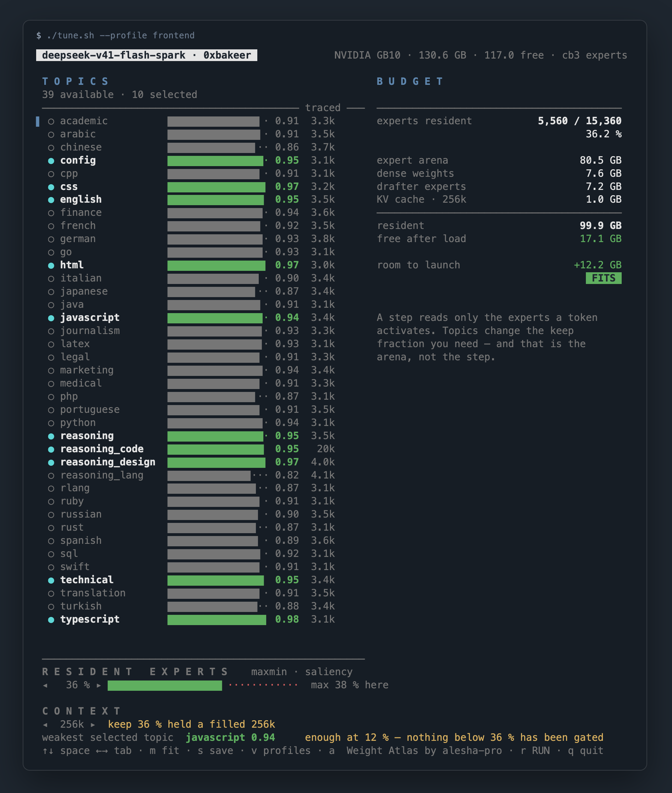
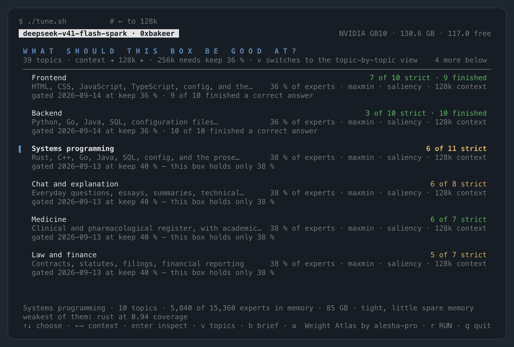
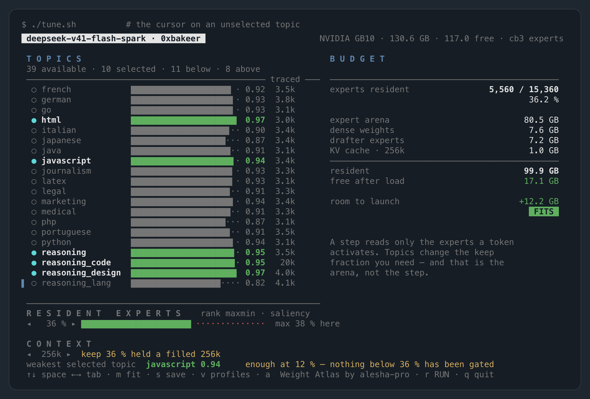
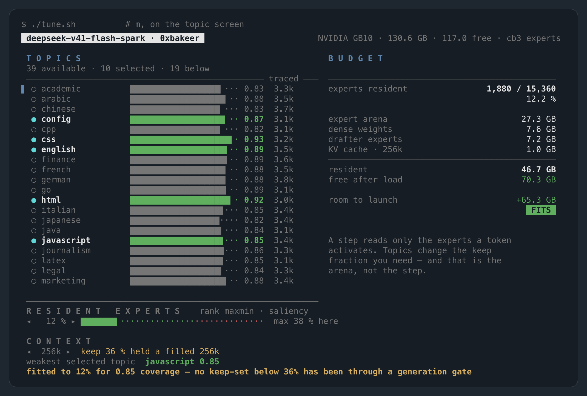

# `./tune.sh` — choosing what the box is good at

Only about a third of this model's routed experts fit in a GB10's memory at once. Which third is
a real choice, and it is the one configuration decision on this machine that changes both what
the model is good at and whether it loads at all.

`./tune.sh` is that choice on one screen: pick a job or pick topics, watch what they cost against
the memory the box has *right now*, see how the generation gate went for that selection, and start
the server from the same screen.

The screen opens on **profiles** — named bundles of topics, the job rather than the experts:

```
 deepseek-v41-flash-spark · 0xbakeer                        NVIDIA GB10 · 130.6 GB · 117.0 free

 W H A T   S H O U L D   T H I S   B O X   B E   G O O D   A T ?
 39 topics · context ◂ 32k ▸ · 256k needs keep 36 %                               6 more below
 ──────────────────────────────────────────────────────────────────────────────────────────────
▌  Frontend                                                        7 of 10 strict · 9 finished
   HTML, CSS, JavaScript, TypeScript…        36 % of experts · maxmin · saliency · 32k context
   gated 2026-09-14 at keep 36 % · 9 of 10 finished a correct answer
   Backend                                                        3 of 10 strict · 10 finished
   Python, Go, Java, SQL, configuration…     36 % of experts · maxmin · saliency · 32k context
   gated 2026-09-14 at keep 36 % · 10 of 10 finished a correct answer
   Systems programming                                                          6 of 11 strict
   Rust, C++, Go, Java, SQL, config, and…    38 % of experts · maxmin · saliency · 32k context
   gated 2026-09-13 at keep 40 % — this box holds only 38 %
   Chat and explanation                                                          6 of 8 strict
   Everyday questions, essays, summaries…    38 % of experts · maxmin · saliency · 32k context
   gated 2026-09-13 at keep 40 % — this box holds only 38 %


 Frontend · 10 topics · 5,560 of 15,360 experts in memory · 80 GB
 weakest of them: javascript at 0.94 coverage
 ↑↓ choose · ←→ context · enter · v topics · a  Weight Atlas by alesha-pro · r RUN · q quit
```

Three rows each. The name, with the gate verdict at the right edge; the description, with what the
bundle costs on the box in front of you; and where that verdict came from — the date of the run,
the keep fraction it measured, and how many of its prompts produced the answer that was asked for
even where the strict gate failed them. Nothing on that screen is a prediction: every count is read
out of the `GATE.md` beside the profile as the screen is drawn.

`enter` applies a profile and drops you into the **topic view**, where every number lives; `r`
applies it and starts the server; `v` moves between the two views at any time. Here is the topic
view with the Frontend bundle applied, at the keep fraction Frontend was gated at:

```
 deepseek-v41-flash-spark · 0xbakeer          NVIDIA GB10 · 130.6 GB · 117.0 free · cb3 experts

 T O P I C S                                          B U D G E T
 39 available · 10 selected · 23 below
 ──────────────────────────────────────── traced ───  ────────────────────────────────────────
▌ ○ academic          ████████████▋· 0.91  3.3k       experts resident          5,560 / 15,360
  ○ arabic            ████████████▊· 0.91  3.5k                                         36.2 %
  ○ chinese           ████████████·· 0.86  3.7k
  ● config            █████████████▎ 0.95  3.1k       expert arena                     80.5 GB
  ○ cpp               ████████████▋· 0.91  3.1k       dense weights                     7.6 GB
  ● css               █████████████▌ 0.97  3.2k       drafter experts                   7.2 GB
  ● english           █████████████▎ 0.95  3.5k       KV cache · 32k                    285 MB
  ○ finance           █████████████▏ 0.94  3.6k       ────────────────────────────────────────
  ○ french            ████████████▊· 0.92  3.5k       resident                         99.2 GB
  ○ german            █████████████· 0.93  3.8k       free after load                  17.8 GB
  ○ go                █████████████· 0.93  3.1k
  ● html              █████████████▌ 0.97  3.0k       room to launch                  +15.7 GB
  ○ italian           ████████████▋· 0.90  3.4k                                          FITS
  ○ japanese          ████████████▏· 0.87  3.4k
  ○ java              ████████████▊· 0.91  3.1k
  ● javascript        █████████████▏ 0.94  3.4k       A step reads only the experts a token
                                                      activates. Topics change the keep
 ───────────────────────────────────────────────────  fraction you need — and that is the
 R E S I D E N T   E X P E R T S  maxmin · saliency   arena, not the step.
 ◂   36 % ▸ █████████████████▍···········  max 40 % here

 C O N T E X T
 ◂   32k ▸  cache has room for 3.7M
 weakest selected topic  javascript 0.94     enough at 12 % — no gate below 36 %
 ↑↓ space ←→ tab · m fit · s save · v profiles · a  Weight Atlas by alesha-pro · r RUN · q quit
```

(The render above was taken with the context selector at 32k. On 2026-09-12 the longest context
this engine has loaded and prefilled from became **131,072**, and `./tune.sh` marks that length now
rather than 32k — `tools/budget.py` `VALIDATED_MAX_SEQ`.)



*The same screen at 256k: coverage per topic with the text each was traced on, and the budget panel against the memory this box has free right now.*

## Has it been gated?

Coverage — the bars in the topic view — measures routing. Whether the output holds together is a
different question, and the two come apart: a profile can score above the coverage target on every
topic it names and still reason in circles, corrupt an identifier, or never leave the think block.
What settles it is a generation run, `tools/gate_profile.py`, and all ten shipped profiles have
been through one (2026-09-13 and 2026-09-14). The screen says how it went.

Two counts, because they measure different things:

* **strict** — the run passed only if the thing the prompt asked for is in the output, the think
  block included. A repeated 12-word window anywhere fails the run.
* **finished** — the strict passes plus the runs whose only fault was that repeat and which
  produced the correct answer anyway. It is counted from 2026-09-14 onwards; older records show
  the strict count alone.

They can disagree sharply. Backend at keep 0.36 is **3 of 10 strict and 10 of 10 finished**: every
prompt got a correct answer, and seven of them restated themselves three to eight times inside the
deliberation first. Frontend at the same keep is 7 and 9. Which of the two matters is the reader's
call, which is why both are on the row.

The gate line under each profile names the run: its date, the keep fraction it measured, and the
ranking pair. When that pair is not the one the screen is set to, it is named in the line — the
bars above and the counts on the right then describe two different keep-sets. Applying the profile
is what resolves that: it takes the pair as well as the keep fraction, the histograms are re-read
off the family the record used, and the line stops naming a pair because there is no longer one to
name. The exception is a keep-set that carries no histograms of that family at all, where nothing
can be switched and the line goes on warning. When the box cannot hold the keep fraction the gate
ran at, the line says so too, because what is about to be started is then not the configuration
that was measured.



*Stepping the context back to 128k lifts the largest keep fraction that fits to 38 %, which six of the profiles are then budgeted at — still under the 40 % their gate ran at, and tight on memory.*

A shipped profile is budgeted at the keep fraction its gate ran at, not at the smallest one that
reaches the coverage target. Those are far apart under the ranking pair the box is run with:
`saliency` puts every topic in the shipped keep-set above 0.85 at keep 0.12, three times below
anything that has ever been asked to generate a sentence. Coverage is still a true measurement of
routing; it is not, under this pair, a recommendation. The topic view says the same thing on the
line above the keys — `enough at 12 % — no gate below 36 %`.

A profile you write yourself reads `untested`, and is budgeted from the coverage target, because
there is no measured keep fraction for it. Running the gate on it is described in
[`docs/tune-tasks.md`](tune-tasks.md).

The records themselves are [`results/keepsets/*/GATE.md`](../results/keepsets/), one dated section
per run, appended and never rewritten. `results/keepsets/gates.json` says which run is each
profile's current record and which keep-set that run measured — the one thing a gate card written
before 2026-09-14 does not carry.

## Why every profile carries a natural-language topic

Every profile carries a natural-language topic, which is not padding. Selecting markup and
stylesheets alone drops English coverage to 0.31, well inside the range where long output falls
apart, and the prose inside an HTML page is English. Adding it back costs the markup topics about
five points of coverage and buys English forty-five.

Those two numbers were measured under `DSV41_PRUNE_RANK=sum` at `PRUNE_KEEP=0.39` (2026-09-11) and
describe neither rule as the box is run now: the working point is 0.36, and `maxmin` equalises the
selected topics instead of trading points between them, so it has no "costs one, buys the other"
shape at all. The direction survives — a markup-only selection starves the English inside the
markup — the exchange rate does not.

Every profile also carries `reasoning` and `reasoning_code`, and for the same kind of reason: run
any of them with thinking on and the experts that write deliberation — and the ones that END it and
begin the answer — live in those two topics and nowhere else. A profile without them can score well
on every topic it names and never close a think block. Under `maxmin` the two cost the other topics
about 0.01 of coverage each. `reasoning_design` is in Frontend and `reasoning_lang` in World
languages for reasons that were measured one at a time; the second of them made European languages
worse and World languages better on the same night, which is why it ships in one and not the other
(`RESULTS.md`, 2026-09-14).

```bash
./tune.sh --profiles              # every profile, with its budget and its gate record
./tune.sh --profile frontend --print
```

`--profile` selects the profile's topics **and the whole configuration its gate ran in** — the keep
fraction, the ranking rule and the histogram family — so `--profile backend --print` emits the
recipe Backend was measured in rather than one assembled out of a coverage target and two defaults:

```
$ ./tune.sh --profile backend --print
PRUNE_KEEP=0.36
DSV41_PRUNE_RANK=maxmin
DSV41_PRUNE_SOURCE=saliency
ARENA_GB=81
...
```

The pair is not decoration: a keep fraction reproduced without it holds a different set of experts.
Switching the family reloads the histograms, so the bars, the budget panel and the written `.env`
all describe the keep-set that was gated. If the loaded keep-set has no histograms of that family,
nothing is switched — writing a source a file cannot be ranked by produces a configuration the
engine refuses three minutes into a load — and the mismatch is said out loud instead, on the gate
line and on stderr.

## Where the header's numbers come from

On a GB10 there is no separate pool to ask about: the memory is unified, and `nvidia-smi` answers
`[N/A]` for `memory.total`, `memory.used` and `memory.free`. So the only honest source is
`/proc/meminfo`, and that is what the header reads — `MemTotal` and `MemAvailable`, live. It is
also what the engine's pre-flight compares against, so the two agree by construction.

`MemAvailable` moves while you look at it. If something else on the box is holding memory the
header says so by name and the Run key refuses, because two processes each reserving an arena
this size wedge the machine past the point where a login can be opened.

## What the numbers mean

**Coverage** — the bar next to each topic — is the fraction of that topic's *measured* routing
that lands on an expert the current budget keeps resident. It is computed from the per-topic
expert histograms in a `coverage.json`, so it is a measurement, not an estimate.

A hollow bar means the topic was traced on too few tokens to rank 384 experts, and the column on
the right says how many. Treat that number as an upper bound rather than a measurement. Coverage
is computed on the same trace that chose the experts, so a topic seen for 300 tokens routes to
whatever fired during those 300 tokens and scores as though it were well served. The shipped
keep-set has no hollow bars left — every one of its 39 topics was traced on about 3,000 tokens —
so the render above shows none; a keep-set you build yourself will, until the evidence is levelled.



*A selected topic is drawn in its coverage colour and an unselected one stays muted, so the bar states read as the selection: reasoning_lang, at 0.82, is the weakest topic in this keep-set and not one Frontend carries.*

What coverage is *not* is a recommendation. It says how much of a topic's measured routing the
budget keeps, and under the ranking pair the box is run with that number is above 0.85 at a keep
fraction nothing has ever generated a sentence at. Which keep fraction to choose is settled by the
generation gate, not by this bar; see [Has it been gated?](#has-it-been-gated) above.

That contamination is measurable. Two traces of the same 35 topics, one averaging a few hundred
tokens each and one averaging three thousand:

| | coverage range | tokens per topic | correlation of tokens with coverage |
|---|---|---|---|
| thin trace | 0.59 – 0.82 | 221 – 2,778 | **−0.36** |
| rebuilt | 0.49 – 0.77 | 3,035 – 3,819 | **−0.00** |

A negative correlation means the *better*-sampled topics scored lower, which is the artefact and
not a property of those topics. Levelling the evidence removes it. Aim for a few thousand tokens a
topic before trusting a bar.

It is also the number that predicts whether long generations hold together. An expert that is
not resident is not routable, so a topic the keep-set does not cover routes to its second
choice on every token, and the output degenerates into repetition. That failure looked for
days like a quantization bug; it was a corpus that contained no markup, and the markup topic's
coverage was 0.03. Raising it to 0.40 fixed it. Coverage below about 0.7 is where that starts.

**Room to launch** reproduces the engine's own pre-flight, which refuses to start when the
arena plus its packing scratch plus the free-memory floor exceeds `MemAvailable`
(`engine/v41_engine.py`). Finding that out by loading costs three minutes; this costs nothing.

**Free after load** is what is left for a prefill chunk once everything resident is resident,
and it is the number that decides whether a configuration serves or dies. One 2,048-token chunk
needs 7.2 GB, plus 15.1 KB for every token of context, so the verdict is `over` whenever less than
that is left — even when the engine's own pre-flight would happily start it. That pre-flight runs
before the drafter experts, the cache and any prefill exist, so it is the looser of the two
checks. On 2026-09-12 a 98 GB arena passed it, reported ready, and was killed by the memory
watchdog on the first request with 5.5 GB free; an 87 GB arena left 16.5 GB and served.

The KV cache is the smallest term on the screen — 285 MB at 32k, 3.4 GB at 1M — so it is not
what bounds the context window. Prefill is, and the tool says how far the box has actually been
run rather than predicting a ceiling it has not reached.

The panel lists everything that holds memory for the whole run. The one thing it leaves out is
the Engram row cache, which is capped at 200,000 rows of 264 bytes per table and two tables, so
53 MB each at most. Engram is also the only thing still read from NVMe once a keep-set is fully
resident: 24 rows per token per table, about 13 KB a token, against zero bytes of expert
weights.

## Fewer topics are not faster. Under `sum` they are cheaper; under `maxmin` breadth is cheap but not free.

A decode step reads the experts the token activates — six of 384 per layer — and that count does
not depend on how the keep-set was chosen. The measured behaviour agrees: across nine workloads
on one keep-set the step is ~145 ms in every case, and the 17-to-37 tok/s spread between them is
entirely the drafter's acceptance length (`RESULTS.md` §4.3). **So selecting fewer topics should
not be expected to make a step faster.**

What it does is reach a given coverage at a *smaller* budget, and the budget is the arena. The two
rows below were measured under `DSV41_PRUNE_RANK=sum` on the `counts` histograms, which is what
`--rank` and `--source` fall back to when nothing sets them; the shipped profiles are budgeted and
served with `maxmin` on `saliency`, which is what `env.example` sets and what the gate runs used:

| selection (`sum` rule) | keep fraction for 0.85 coverage | arena |
|---|---|---|
| `coding` alone | 32 % | 71 GB |
| `coding` + `general` | 51 % | more than this box holds |

Those are the two topics the shipped `general` keep-set carries, and the numbers are its own —
name the topics whenever you quote a figure like this, because a different pair gives a different
answer. On the shipped 35-topic keep-set the same comparison runs 29 % for `python` alone, 35 % adding
`html`, 49 % adding `german`. Under `sum` that direction holds: each topic you add costs keep
fraction, and keep fraction is arena.

`DSV41_PRUNE_RANK=maxmin` changes the size of that cost, not its sign. Hand the slots out to
whichever selected topic is currently least covered and the same four-to-eighteen-topic span costs
the worst-served topic 0.06 instead of the 0.247 it costs under `sum` (`PRUNE_KEEP=0.36`, measured
2026-09-12). Breadth is cheap there — but not free, and not unbounded: at that keep fraction about
sixteen topics already puts the worst-served one at 0.671, under the 0.7 line. So under `maxmin`
"deselect a topic" is a weak lever and the format, the keep fraction and the arena are the strong
ones; under `sum` it is the second-strongest thing on the screen.

That is the trade the screen is built around. Press `m` to snap the keep fraction to the
smallest one that serves every selected topic, and read the arena off the panel. The 27 GB
between the two rows above is context window and prefill room.



*After `m` on the Frontend selection: the keep fraction snapped to 12 %, an arena of 27 GB rather than the 80 GB the gated 36 % needs, and the key line saying that no keep-set below 36 % has been through a generation gate.*

> **Not measured yet.** There is one path by which topic choice could touch step time after all.
> Speculative decoding verifies a block of six tokens, and that block touches about 21 *distinct*
> experts per layer rather than six. A keep-set matched to the workload may concentrate routing
> and lower that count. `block6_unique_mean` in `coverage.json` is measured without a keep mask,
> so it cannot answer this — only an A/B at a fixed keep fraction with one topic against many
> can, and it has not been run. Until it is, treat the paragraph above as the mechanism, not a
> measurement.

## `a` — the same keep-sets, drawn

The screen budgets 15,360 experts and can never show you one. `a`, on either view, opens
**Weight Atlas by alesha-pro** ([github.com/alesha-pro/atlas](https://github.com/alesha-pro/atlas),
MIT, vendored in `tools/atlas/`) on this checkout's own trace: the whole expert field as a 40 × 384
grid, a column per expert and a row per layer, coloured by REAP saliency — the same numbers the
bars on this screen are computed from. Any of the 39 topics can be taken as a slice of it, and each
of the ten shipped profiles is an outline over the grid, holding the same experts at the same keep
fraction its generation gate was run at. It is the one view in which "Frontend at keep 36 %" is a
shape rather than a list of 5,560 ids.

The first press exports the data (about two seconds; `tools/atlas/models/`, ~5.6 MB, generated and
not committed) and starts a static server bound to `127.0.0.1` on a port the kernel picks, which
dies with the screen. The popup says the port and the `ssh -L` line for a box you are on over ssh.
`./tune.sh --atlas` does all of it without a terminal, and `--atlas-export` writes the files
without serving them. What the page is, what was patched into it and why are in
[`tools/atlas/UPSTREAM.md`](../tools/atlas/UPSTREAM.md).

## Without a terminal

```bash
./tune.sh --atlas                         # serve Weight Atlas on this keep-set, no terminal needed
./tune.sh --render 30x96                  # the screen as text, no terminal needed
./tune.sh --list                          # the topics this keep-set carries, with coverage
./tune.sh --topics python,html --print    # the environment that selection implies
./tune.sh --topics python,html --write    # write those settings into .env
```

`--print` exits non-zero when the selection will not load, so it works as a check in a script.
The interactive `r` writes the same settings and then runs `./start.sh`; `w` writes them and
stops. `.env` is only touched for the ten keys the tool manages — `EXPERT_TOPICS`, `PRUNE_KEEP`,
`MAX_SEQ`, `ARENA_GB`, `EXPERT_FORMAT`, `TRACE_STATS`, `TRANSIENT_SLOTS` and `KEEP_FREE_GB`, which
it must write because the arena was sized against them, and `DSV41_PRUNE_RANK` and
`DSV41_PRUNE_SOURCE`, which it must write because a keep fraction reproduced without its ranking
pair reproduces a different set of experts. Those last two are written under the engine's own
names, which is how the engine reads them. The previous file is kept as `.env.bak`.

## Where topics come from

A topic is one per-layer expert histogram, measured by routing a corpus of that topic alone
through the model. They are stored inside `coverage.json` next to the mixed histogram, so
composing a keep-set out of several of them is arithmetic on numbers already in the checkout —
it needs no GPU and no new trace.

`corpus/fetch_topics.py` gathers the sources for a 35-topic catalogue — sixteen programming
languages from a tree you point it at, eleven natural languages and eight domain registers from
Wikipedia — and prints the `--topic` flags for the next step. (The shipped keep-set is those 35
plus four hand-written deliberation topics; see below.)

```bash
python3 corpus/fetch_topics.py --list                       # the catalogue
python3 corpus/fetch_topics.py --out topics --code-root ~/src
python3 corpus/make_corpus.py --tokenizer $MODEL_DIR --target 3000 \
    --out corpus/trace_topics.jsonl \
    $(python3 corpus/fetch_topics.py --out topics --print-topic-flags)
```

It asks Wikipedia for twenty article introductions at a time, one request every two seconds, and
backs off when told to. A burst of parallel requests earns an IP-level rate limit that outlasts
the job.

`--print-topic-flags` emits a flag for every file `fetch_topics.py` itself wrote, so it never emits
the four hand-written topics the catalogue has gained — `reasoning`, `reasoning_code`,
`reasoning_design` and `reasoning_lang`, whose kind is `think` rather than `prose` because what
they carry is deliberation, think block and all. Three of their sources are in the checkout under
`corpus/sources/`. Add the flags by hand alongside the generated ones, or those topics are silently
absent from the corpus and nothing on the screen will say so — which is exactly the gap a coverage
bar cannot show:

```bash
python3 corpus/make_corpus.py --tokenizer $MODEL_DIR --target 3000 \
    --out corpus/trace_topics.jsonl \
    --topic reasoning_code:think:corpus/sources/reasoning_code.txt \
    --topic reasoning_design:think:corpus/sources/reasoning_design.txt \
    --topic reasoning_lang:think:corpus/sources/reasoning_lang.txt \
    $(python3 corpus/fetch_topics.py --out topics --print-topic-flags)
```

The shipped keep-set is those 35 plus those four: **39 topics**, each traced on about 3,000 tokens.

To add a topic of your own, see [`docs/tune-tasks.md`](tune-tasks.md), which carries the complete
commands. In outline: tag the sources with a topic name, build the corpus, fetch the Engram rows
it needs, trace it layer by layer, and turn the trace into a `coverage.json`.

The trace is one pass over the corpus per layer and costs about the same whether the corpus
carries five topics or thirty-five, so it is worth tagging generously.

Selecting no topics is not an error: the engine then ranks on every topic in the file, which is
what the shipped profiles in `results/keepsets/` do.

## Checks

```bash
python3 tools/test_budget.py         # the cost model against two loads this box actually ran
python3 tools/test_tune_draw.py      # the screens render at seven sizes without colliding
python3 tools/test_tune_profiles.py  # profiles, and the gate records behind them
python3 tools/test_tune_brief.py     # the brief comes from the keep-set, and its commands are real
python3 tools/test_atlas_export.py   # the Weight Atlas outlines are the engine's own keep-sets
python3 tools/test_tune_atlas.py     # the `a` key: legend, popup, and a real loopback fetch
```

`test_budget.py` cross-checks the slot sizes against the kernel's own constant, the KV formula
against two measured lengths, and the launch gate against an arena the box accepted and one it did
not. `test_tune_profiles.py` also checks every gate record the screen quotes: that each shipped
profile's record exists, that it was run on exactly the topics that profile ships, that nothing
newer in the same file supersedes it, and that `results/keepsets/gates.json` names runs that are
really in those files. None of them needs a GPU, the checkpoint or torch.
